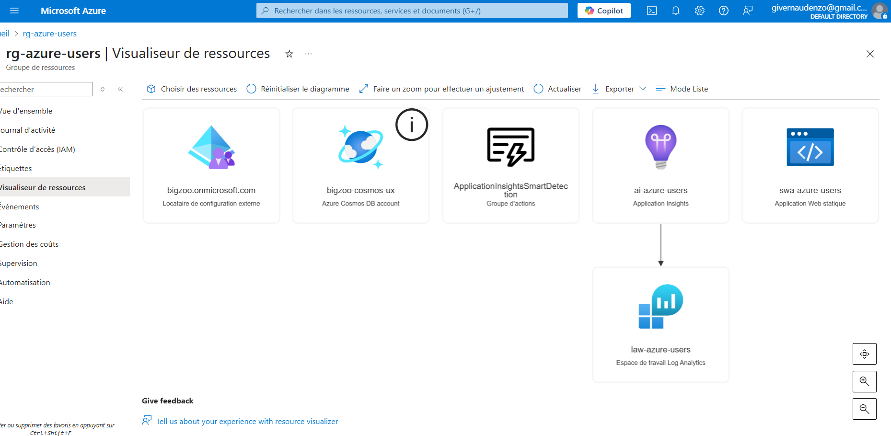
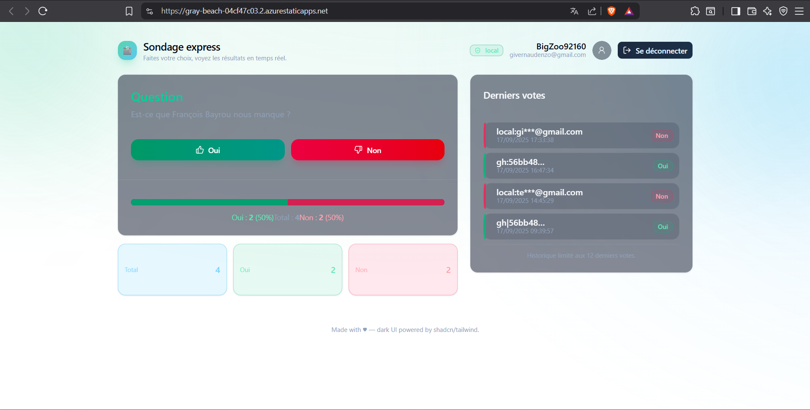

# Sondage Express — Azure Static Web Apps + Functions + Cosmos DB

**Demo :** [https://gray-beach-04cf47c03.2.azurestaticapps.net/](https://gray-beach-04cf47c03.2.azurestaticapps.net/)


Application de sondage full-Azure : **front statique (Vite/React)**, **API serverless (Azure Functions Node 20)**, **stockage Cosmos DB**, **auth GitHub + email/mot de passe**, **CI/CD GitHub Actions**, et **monitoring Application Insights**.
Le front est servi par **Azure Static Web Apps (SWA)** qui joue aussi le rôle de **reverse-proxy** `/api/*` vers les Functions (même ressource), ce qui permet un **déploiement très rapide** du front et des APIs.

---

## ✨ Fonctionnalités

* Vote “Oui / Non” à une question unique, résultats temps réel.
* Authentification :

  * **GitHub OAuth** via SWA (`/.auth/login/github`).
  * **Email + mot de passe** (hash `bcryptjs`) avec **cookie de session JWT** (HttpOnly, Secure).
* API serverless :

  * `GET /api/me` – hydrate la session (JWT ou principal SWA GitHub).
  * `POST /api/auth/signup` – création compte local.
  * `POST /api/auth/login` / `POST /api/auth/logout`.
  * `POST /api/vote` – enregistre/écrase le vote utilisateur (idempotent).
  * `GET /api/votes` – stats agrégées + derniers votes.
* **Cosmos DB** (API SQL) :

  * Container `users` (PK = `/id`, `id = local:<email>` ou `gh:<sub>`).
  * Container `votes` (PK = `/id`, `id = <userId>`, vote idempotent par utilisateur).
* **Monitoring** **Application Insights** + Workbooks :

  * KPIs : total votes, % Oui/Non, utilisateurs actifs, latence & erreurs.
  * Événements personnalisés : `vote`, `login`, `error` (customDimensions).
* **CI/CD GitHub Actions** (build + tests + déploiement SWA).
* **UI** dark mode **shadcn/ui**.

---

## 🧱 Architecture

```
Azure Static Web Apps
├─ Front (Vite/React) → CDN global
├─ Reverse-Proxy /api/* → Functions runtime (Node 20)
└─ Auth intégrée (.auth/*) → GitHub (et JWT local côté API)

Azure Functions (SWA managed)
├─ /api/me, /api/auth/*, /api/vote, /api/votes
├─ Cosmos DB SDK v4
└─ App Insights SDK (custom events/metrics)

Azure Cosmos DB (SQL)
├─ Database: <pollsdb>
├─ Container users  (PK=/id)
└─ Container votes  (PK=/id)
```

---

## 📦 Monorepo & Arborescence

```
apps/
├─ web/                # Front Vite + React + shadcn/ui
│  ├─ src/pages        # /auth, / (polls)
│  ├─ src/components   # VoteCard, VotesTable, UI
│  └─ src/hooks        # useSession, useVotes
└─ api/                # Azure Functions (TypeScript ESM, Node 20)
   ├─ src/functions    # me.ts, auth.*.ts, vote.ts, votes.ts, health.ts
   ├─ src/data         # usersRepo.ts, votesRepo.ts
   ├─ src/lib          # session.ts (JWT cookie), authz.ts, telemetry.ts, cosmos.ts
   └─ host.json / tsconfig.json

staticwebapp.config.json  # routes, rewrites, allowedRoles, 401 override
```

---

## 🔧 Configuration (env)

Ajouter ces variables **dans la configuration de l’API** (SWA → *Configuration* → *API environment variables*) :

* `COSMOS_ENDPOINT` – URL compte Cosmos.
* `COSMOS_KEY` – clé primaire.
* `COSMOS_DB` – nom de la database (ex. `pollsdb`).
* `COSMOS_USERS_CONTAINER` – `users`.
* `COSMOS_VOTES_CONTAINER` – `votes`.
* `JWT_SECRET` – secret (au moins 32 chars) pour signer le cookie session.
* `APPINSIGHTS_CONNECTION_STRING` – connexion Application Insights.

> SWA gère GitHub OAuth. Les routes et protections sont dans `staticwebapp.config.json` (ex. `allowedRoles`, `responseOverrides.401`).

---

## ▶️ Lancer en local

```bash
# 1) Dépendances
pnpm install

# 2) Front (Vite)
pnpm -C apps/web dev

# 3) API (Functions + tsc watch)
pnpm -C apps/api dev
# (ou 'func start' si déjà buildé)
```

> Astuce : pour simuler GitHub localement, on s’appuie surtout sur le **cookie session** (login local). En prod, `GET /api/me` lit aussi `x-ms-client-principal` (SWA) pour GitHub.

---

## 🚀 CI/CD (GitHub Actions)

* **Pipeline** : `.github/workflows/swa.yml`

  * Build du front et de l’API.
  * Étape **tests** (web + api) avant déploiement.
  * Déploiement via `Azure/static-web-apps-deploy@v1` (upload pré-build).
* Secret requis : `AZURE_STATIC_WEB_APPS_API_TOKEN`.

Extrait (tests + déploiement) :

```yaml
- name: Test web
  run: pnpm -C apps/web test:ci
- name: Test api
  run: pnpm -C apps/api test:ci

- name: Deploy to Azure Static Web Apps (upload prebuilt)
  uses: Azure/static-web-apps-deploy@v1
  with:
    azure_static_web_apps_api_token: ${{ secrets.AZURE_STATIC_WEB_APPS_API_TOKEN }}
    action: upload
    app_location: apps/web/dist
    app_artifact_location: .
    skip_app_build: true
    api_location: apps/api
```

---

## 🔒 Auth & Sécurité

* **GitHub** : SWA gère l’OAuth et expose le principal via `x-ms-client-principal`.
  L’API **pose un cookie JWT** afin d’unifier la session front/back.
* **Local** : email + mot de passe (hash `bcryptjs`), `id = local:<email>`.
* **Vote** : endpoint `POST /api/vote` lit **uniquement** l’identité depuis le **JWT** (ou principal SWA) pour éviter les redirections automatiques `.auth/*`.

---

## 📊 Monitoring & Observabilité

### SDK & événements

* `APPINSIGHTS_CONNECTION_STRING` injectée côté API.
* Traçages custom :

  * `trackVote(userId, "yes"|"no")`
  * `trackLogin(userId, provider)`
  * `trackError(error, { where })`

### Workbooks / Dashboards (à créer dans Application Insights)

* **KPI carte** : Total de votes, % Oui/Non, Utilisateurs actifs (24h), Latence P50/P95.
* **Graphes** :

  * Événements `vote` par minute (pile Oui/Non).
  * `requests` par route (latence & status).
  * `exceptions` (taux, message top N).

### Exemples KQL

```kusto
// Total votes
customEvents
| where name == "vote"
| summarize total = count()

// % Oui / Non
customEvents
| where name == "vote"
| summarize yes = countif(customDimensions.choice == "yes"),
            no  = countif(customDimensions.choice == "no")
| extend yesPct = todouble(yes) * 100.0 / (yes + no)

// Utilisateurs actifs 24h (distinct userId)
customEvents
| where name == "vote" and timestamp > ago(24h)
| summarize dcount(customDimensions.userId)

// Latence API par route (P50/P95/Max)
requests
| summarize p50 = percentile(duration, 50),
            p95 = percentile(duration, 95),
            max = max(duration) by name
| order by p95 desc
```

> Pensez à ajouter des **captures** :
> `docs/screens/overview.png`, `docs/screens/kpis.png`, `docs/screens/errors.png`.

---

## 🧪 Tests

* **Web** : Vitest + JSDOM (`pnpm -C apps/web test:ci`), ex. test de base `1+1=2`.
* **API** : tests légers (Vitest/ts-node) pour fonctions pures (ex. helpers).
* En CI : les deux jobs **must-pass** avant déploiement.

---

## 🧭 Routes & Proxy (SWA)

`staticwebapp.config.json` (extraits — proxy + garde) :

```json
{
  "platform": { "apiRuntime": "node:20" },
  "navigationFallback": {
    "rewrite": "/index.html",
    "exclude": ["/api/*","/assets/*","/*.css","/*.js","/*.ico","/*.png","/*.svg","/*.webp","/*.txt","/*.xml","/*.woff","/*.woff2","/*.ttf"]
  },
  "routes": [
    { "route": "/", "rewrite": "/index.html" },
    { "route": "/auth", "rewrite": "/index.html" },

    { "route": "/api/me",          "allowedRoles": ["anonymous","authenticated"] },
    { "route": "/api/auth/login",  "allowedRoles": ["anonymous","authenticated"] },
    { "route": "/api/auth/signup", "allowedRoles": ["anonymous","authenticated"] },
    { "route": "/api/auth/logout", "allowedRoles": ["anonymous","authenticated"] },

    { "route": "/api/votes",       "allowedRoles": ["anonymous","authenticated"] },
    { "route": "/api/vote",        "allowedRoles": ["authenticated"] }
  ],
  "responseOverrides": {
    "401": { "redirect": "/.auth/login/github?post_login_redirect_uri=/" }
  }
}
```

> En prod, **/api/vote** exige un utilisateur authentifié ; la fonction vérifie aussi le **JWT** pour éviter les redirections `.auth/*` parasites.

---

## 🖼️ Screenshots (à compléter)

* **Architecture & déploiement**

  * 
* **Monitoring**

  * 
* **Application**

  * 


---

## 📌 Points clés

* **Azure-first** : hébergement, API, base, auth, monitoring – tout est managé Azure.
* **SWA = reverse-proxy** → front ultra-rapide, APIs serverless, un seul point d’entrée.
* **Observabilité** dès le départ (App Insights + KQL/Workbooks).
* **DevX** : monorepo pnpm, Vite HMR, Functions Core Tools, CI/CD GitHub Actions.